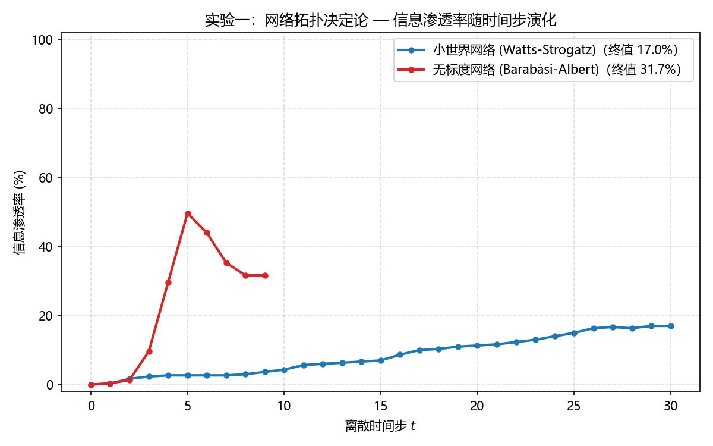
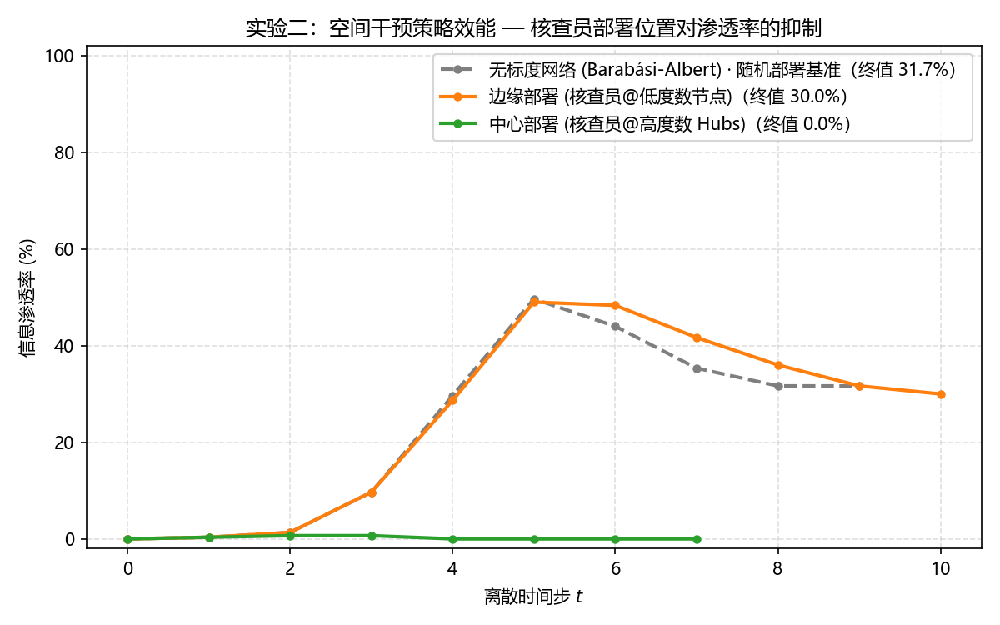
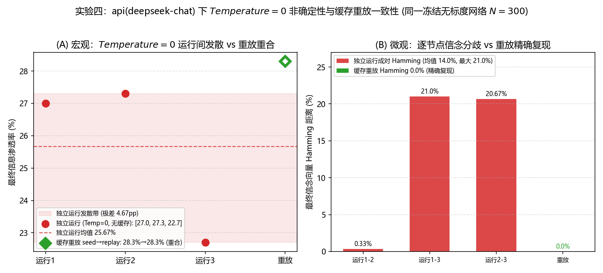
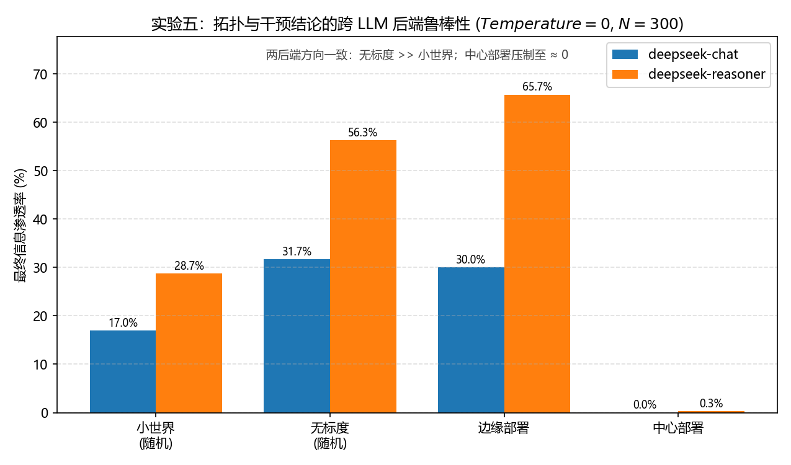
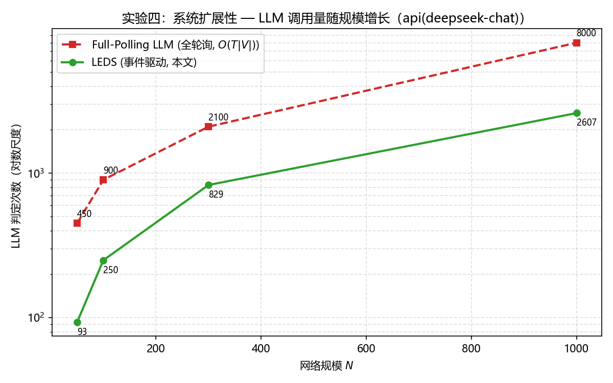
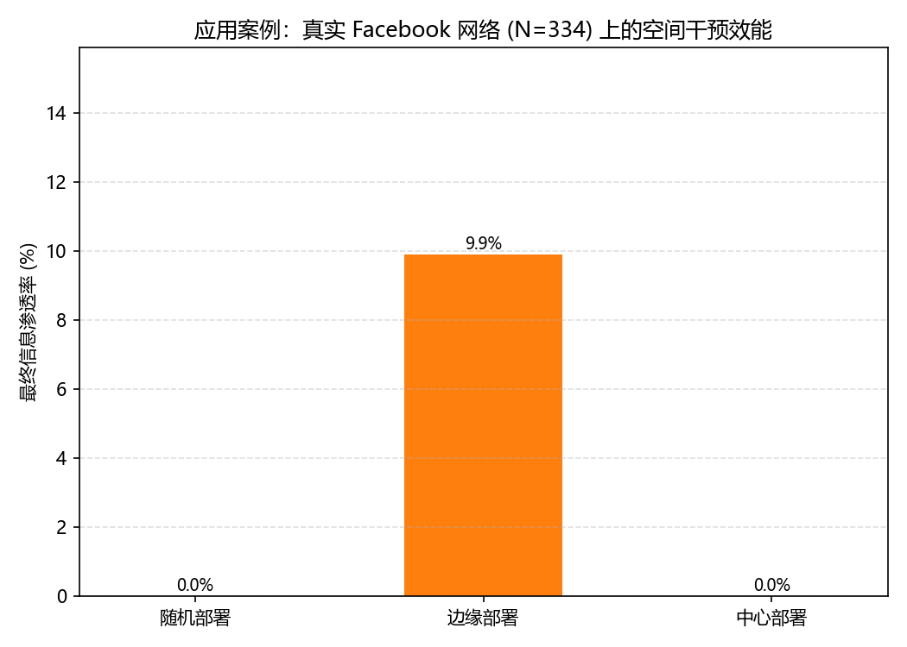

# LEDS 确定性仿真实验结果报告

> 本报告为 LEDS 六组实验的综合结果报告。其中实验一、二的逐时间步表由 `src/stage3_evaluate.py` 依据 `results/logs/` 中的状态机运行日志生成；实验三至六分别汇编自 `results/baselines.json`、`results/determinism_probe.json`、`results/summary_deepseek-reasoner.json`、`results/scalability.json`。全部数值与对应结果文件逐项一致，重跑相应脚本后更新。

## 1. 实验环境与全局参数

- **推理后端**：api(deepseek-chat)
- **解码约束**（论文 3.4 节）：`Temperature = 0.0`，`Top_P = 1.0`，仿真运行期不使用任何伪随机数种子
- **网络规模**：$N = 300$；人设比例：易感者 60% / 中立者 30% / 核查员 10%（论文 4.2 节）
- **初始信息源**：节点 47（四组实验共用同一注入点，控制变量）；注入消息：“长期佩戴新型AR眼镜会导致短期隐性记忆丧失”
- **稳态判据**：事件队列为空（$M_T=\emptyset$，论文 3.1 节 Stage 3）；最大容许时间步 $T_{max}=30$
- **可复现性验证（须区分两种情形）**：其一，**缓存重放**下（即复用首次运行记录的 Prompt/Response），状态机日志逐字段完全一致、渗透率波动为 **0**（见 `determinism_probe.json` 的 `cache_replay`，逐节点 Hamming 距离 0.0%）；其二，**无缓存的独立重复运行**下，即便 `Temperature=0`，云端推理仍非字节确定，渗透率存在运行间波动（3 次独立运行极差约 4.7 个百分点、逐节点信念最高 21.0% 不一致，见 `determinism_probe.json` 的 `independent_runs` 与 `pairwise_divergence`）。故本框架的复现一致性来自**缓存重放机制**，而非"重复运行自然相同"（对应论文 3.4/4.6 节）

## 2. 实验数据总览（表 1）

| 实验场景 | 网络拓扑 | 核查员部署 | 最终渗透率 | 稳态步数 | LLM 判定次数 | Accept/Neutral/Reject |
| --- | --- | --- | ---: | ---: | ---: | :---: |
| 小世界网络 (Watts-Strogatz) | 小世界 WS(k=4, p=0.1) | 基准随机分布 | **17.0%** | 30 | 394 | 51 / 136 / 113 |
| 无标度网络 (Barabási-Albert) | 无标度 BA(m=2) | 基准随机分布 | **31.7%** | 9 | 662 | 95 / 67 / 138 |
| 边缘部署 (核查员@低度数节点) | 无标度 BA(m=2) | 度数最低 30 个边缘节点 | **30.0%** | 10 | 733 | 90 / 57 / 153 |
| 中心部署 (核查员@高度数 Hubs) | 无标度 BA(m=2) | 度数最高 Top-30 Hubs | **0.0%** | 7 | 438 | 0 / 25 / 275 |

**字段解释**：*最终渗透率* = 稳态时信念为 Accept 的节点数 / 总节点数（Algorithm 1 第 33 行）；*稳态步数* = 事件队列耗散为空所用的离散时间步；*LLM 判定次数* = 整个仿真周期触发 $f_{LLM}$ 状态转移的总次数，体现事件驱动机制的算力开销（远低于全连接遍历的 $N \times T$ 上限）；*Accept/Neutral/Reject* = 稳态信念分布。

## 3. 实验一：网络拓扑决定论（论文 4.6 节）

**实验条件**：两组共用同一人设映射与同一信息源，唯一控制变量为拓扑结构。核查员位置（基准随机分布）：29(度=3)、38(度=4)、63(度=5)、75(度=4)、93(度=4)、102(度=4)、105(度=4)、108(度=5)、111(度=4)、125(度=4)、135(度=4)、155(度=4)、158(度=3)、169(度=2)、178(度=4)、181(度=4)、209(度=4)、210(度=4)、212(度=4)、213(度=5)、238(度=3)、239(度=3)、240(度=4)、255(度=4)、265(度=4)、269(度=4)、272(度=4)、278(度=5)、292(度=4)、296(度=4)。

### 3.1 小世界网络（配置 A）逐步数据（表 2）

| 时间步 $t$ | 活跃节点数 | LLM 判定次数 | 新消息数 | Accept | Neutral | Reject | 渗透率 |
| ---: | ---: | ---: | ---: | ---: | ---: | ---: | ---: |
| 0 | 0 | 0 | 1 | 0 | 300 | 0 | 0.0% |
| 1 | 1 | 1 | 4 | 1 | 299 | 0 | 0.3% |
| 2 | 4 | 4 | 17 | 5 | 295 | 0 | 1.7% |
| 3 | 12 | 12 | 11 | 7 | 292 | 1 | 2.3% |
| 4 | 9 | 9 | 11 | 8 | 287 | 5 | 2.7% |
| 5 | 8 | 8 | 10 | 8 | 285 | 7 | 2.7% |
| 6 | 9 | 9 | 12 | 8 | 279 | 13 | 2.7% |
| 7 | 8 | 8 | 17 | 8 | 275 | 17 | 2.7% |
| 8 | 14 | 14 | 23 | 9 | 269 | 22 | 3.0% |
| 9 | 19 | 19 | 22 | 11 | 258 | 31 | 3.7% |
| 10 | 18 | 18 | 21 | 13 | 248 | 39 | 4.3% |
| 11 | 18 | 18 | 33 | 17 | 239 | 44 | 5.7% |
| 12 | 23 | 23 | 31 | 18 | 229 | 53 | 6.0% |
| 13 | 26 | 26 | 21 | 19 | 216 | 65 | 6.3% |
| 14 | 19 | 19 | 30 | 20 | 207 | 73 | 6.7% |
| 15 | 26 | 26 | 17 | 21 | 199 | 80 | 7.0% |
| 16 | 14 | 14 | 25 | 26 | 192 | 82 | 8.7% |
| 17 | 19 | 19 | 24 | 30 | 186 | 84 | 10.0% |
| 18 | 20 | 20 | 12 | 31 | 182 | 87 | 10.3% |
| 19 | 10 | 10 | 8 | 33 | 180 | 87 | 11.0% |
| 20 | 8 | 8 | 3 | 34 | 179 | 87 | 11.3% |
| 21 | 3 | 3 | 4 | 35 | 178 | 87 | 11.7% |
| 22 | 4 | 4 | 8 | 37 | 176 | 87 | 12.3% |
| 23 | 6 | 6 | 9 | 39 | 174 | 87 | 13.0% |
| 24 | 9 | 9 | 12 | 42 | 171 | 87 | 14.0% |
| 25 | 9 | 9 | 12 | 45 | 168 | 87 | 15.0% |
| 26 | 11 | 11 | 15 | 49 | 164 | 87 | 16.3% |
| 27 | 13 | 13 | 12 | 50 | 161 | 89 | 16.7% |
| 28 | 12 | 12 | 17 | 49 | 155 | 96 | 16.3% |
| 29 | 15 | 15 | 36 | 51 | 144 | 105 | 17.0% |
| 30 | 27 | 27 | 13 | 51 | 136 | 113 | 17.0% |

### 3.2 无标度网络（配置 B）逐步数据（表 3）

| 时间步 $t$ | 活跃节点数 | LLM 判定次数 | 新消息数 | Accept | Neutral | Reject | 渗透率 |
| ---: | ---: | ---: | ---: | ---: | ---: | ---: | ---: |
| 0 | 0 | 0 | 1 | 0 | 300 | 0 | 0.0% |
| 1 | 1 | 1 | 3 | 1 | 299 | 0 | 0.3% |
| 2 | 3 | 3 | 41 | 4 | 296 | 0 | 1.3% |
| 3 | 37 | 37 | 170 | 29 | 269 | 2 | 9.7% |
| 4 | 121 | 121 | 397 | 89 | 201 | 10 | 29.7% |
| 5 | 221 | 221 | 273 | 149 | 105 | 46 | 49.7% |
| 6 | 139 | 139 | 136 | 132 | 80 | 88 | 44.0% |
| 7 | 104 | 104 | 40 | 106 | 69 | 125 | 35.3% |
| 8 | 32 | 32 | 4 | 95 | 67 | 138 | 31.7% |
| 9 | 4 | 4 | 0 | 95 | 67 | 138 | 31.7% |

### 3.3 结果解释

- **渗透率差异**：无标度网络最终渗透率 31.7%，高出小世界网络（17.0%）14.7 个百分点。无标度网络中的中心节点（Hubs）一旦被感染即向大量邻居扇出，单步最高派发 397 条新消息，形成论文所述的“放大效应”；小世界网络因高聚类、低度数，传播只能沿局部环状结构逐跳推进。
- **收敛速度**：无标度网络仅 9 步即达稳态，小世界网络需 30 步；前者较短的平均路径长度使信息在极短时间步内飙升，与论文 4.6 节的定性预期一致。
- **可归因性与噪声边界**：本组为每个拓扑单次运行的结果，唯一受控变量为拓扑结构。需注意：由于云端 LLM 在 `Temperature=0` 下仍存在运行间波动（见非确定性探针，无标度发散带约 22.7%–31.7%），无标度单次值 31.7% 与小世界 17.0% 的 14.7 个百分点差距应与该波动量级并读；其方向性（无标度 > 小世界）另在 `deepseek-reasoner` 后端上以更大间距复现（56.3% vs 28.7%），佐证该趋势并非采样噪声所致。此外小世界一列为 $T_{max}=30$ 截断值（未队列耗尽、时序仍上升），其真实稳态可能更高，故结论宜表述为"无标度在噪声带之上仍系统性高于小世界"，而非精确到百分点的确定性差值。

## 4. 实验二：空间干预策略效能（论文 4.6 节）

**实验条件**：拓扑固定为无标度网络（同配置 B），核查员总量恒为 30 个（10%），仅改变部署位置。
- 边缘部署核查员：13(度=2)、20(度=2)、21(度=2)、38(度=2)、39(度=2)、46(度=2)、53(度=2)、54(度=2)、58(度=2)、59(度=2)、60(度=2)、63(度=2)、69(度=2)、75(度=2)、78(度=2)、86(度=2)、87(度=2)、92(度=2)、94(度=2)、96(度=2)、102(度=2)、104(度=2)、106(度=2)、110(度=2)、112(度=2)、115(度=2)、117(度=2)、118(度=2)、119(度=2)、125(度=2)
- 中心部署核查员：0(度=23)、1(度=8)、2(度=17)、3(度=21)、4(度=34)、5(度=12)、6(度=27)、7(度=24)、8(度=17)、9(度=9)、10(度=41)、11(度=8)、14(度=9)、15(度=31)、16(度=9)、17(度=11)、22(度=7)、25(度=17)、26(度=8)、27(度=10)、28(度=11)、29(度=7)、31(度=8)、32(度=8)、33(度=10)、35(度=10)、45(度=9)、52(度=7)、62(度=7)、66(度=7)

### 4.1 边缘部署逐步数据（表 4）

| 时间步 $t$ | 活跃节点数 | LLM 判定次数 | 新消息数 | Accept | Neutral | Reject | 渗透率 |
| ---: | ---: | ---: | ---: | ---: | ---: | ---: | ---: |
| 0 | 0 | 0 | 1 | 0 | 300 | 0 | 0.0% |
| 1 | 1 | 1 | 3 | 1 | 299 | 0 | 0.3% |
| 2 | 3 | 3 | 41 | 4 | 296 | 0 | 1.3% |
| 3 | 37 | 37 | 172 | 29 | 268 | 3 | 9.7% |
| 4 | 120 | 120 | 396 | 86 | 199 | 15 | 28.7% |
| 5 | 220 | 220 | 282 | 147 | 109 | 44 | 49.0% |
| 6 | 148 | 148 | 146 | 145 | 85 | 70 | 48.3% |
| 7 | 109 | 109 | 75 | 125 | 65 | 110 | 41.7% |
| 8 | 57 | 57 | 34 | 108 | 59 | 133 | 36.0% |
| 9 | 28 | 28 | 10 | 95 | 57 | 148 | 31.7% |
| 10 | 10 | 10 | 0 | 90 | 57 | 153 | 30.0% |

### 4.2 中心部署逐步数据（表 5）

| 时间步 $t$ | 活跃节点数 | LLM 判定次数 | 新消息数 | Accept | Neutral | Reject | 渗透率 |
| ---: | ---: | ---: | ---: | ---: | ---: | ---: | ---: |
| 0 | 0 | 0 | 1 | 0 | 300 | 0 | 0.0% |
| 1 | 1 | 1 | 3 | 1 | 299 | 0 | 0.3% |
| 2 | 3 | 3 | 41 | 2 | 296 | 2 | 0.7% |
| 3 | 37 | 37 | 190 | 2 | 260 | 38 | 0.7% |
| 4 | 137 | 137 | 332 | 0 | 144 | 156 | 0.0% |
| 5 | 192 | 192 | 86 | 0 | 37 | 263 | 0.0% |
| 6 | 64 | 64 | 4 | 0 | 26 | 274 | 0.0% |
| 7 | 4 | 4 | 0 | 0 | 25 | 275 | 0.0% |

### 4.3 结果解释

- **边缘部署收效有限**：以随机部署核查员的无标度网络（31.7%，含 10% 随机分布核查员，并非零干预）为基准，边缘部署（绑定低度数节点）最终渗透率为 30.0%，相对基准抑制 1.7 个百分点。低度数节点的辟谣声明辐射面过窄（本轮共发生 103 次辟谣动作，纠偏转移 95 次），无法阻挡经由 Hubs 的信息洪流。
- **中心部署形成早期阻断**：渗透率被确定性地压制到 0.0%（较随机部署基准降低 31.7 个百分点），且系统仅 7 步即耗散收敛。微观日志显示，首次辟谣动作发生于 $t=2$（节点 3、8、0、2、4、5、6、17、20、25、26、32、35、66、118、167、237、272、281、283、0、1、2、3、4、5、6、7、8、9、10、11、14、15、16、17、22、25、27、28、29、31、34、36、43、44、45、50、52、57、59、60、62、66、67、72、81、84、86、89、99、104、106、107、109、112、119、123、126、148、162、175、176、196、197、208、216、218、220、221、227、231、248、266、267、289、292、297、0、1、2、4、5、6、7、9、10、11、14、15、16、17、25、26、27、28、29、31、32、33、35、51、58、61、62、66、85、94、117、129、134、145、152、154、157、159、180、182、195、199、211、214、241、255、265、268、269、278、295、296、298、1、7、9、10、11、15、16、22、27、28、29、31、33、62、166、286），高度数核查员将辟谣声明直接扇出至大量邻居，使后续易感/中立节点在接触谣言前已被“免疫”，传播链在源头附近即被切断。
- **结论**：中心部署与边缘部署的效能差达 30.0 个百分点，定量验证了“影响力最大化”理论 [14] 在语言智能体网络中的适用性。

## 5. 实验三：API 成本与方差基线对比（论文 4.3 节）

**实验条件**：在同一冻结的无标度网络（配置 B，$N=300$）上，以真实 `deepseek-chat` 比较四种范式的开销与稳定性。数据源 `results/baselines.json`。

### 5.1 汇总（表 6）

| 仿真框架 | $f_{LLM}$ 评估次数 | 墙钟耗时 (s) | 最终渗透率（均值 ± 95%CI） | 无效 JSON 率 | 兜底回退 | 稳态步数 |
| :--- | ---: | ---: | :---: | ---: | ---: | ---: |
| LEDS（事件驱动, Temp=0, 本文） | 701 | 883.97 | 27.0%（缓存重放可精确复现） | 0% | 0 | 11 |
| Full Polling（全轮询, Temp=0） | 2,400 | 470.75 | 7.3% | 0% | 0 | 8 |
| Monte Carlo（Temp=0.7, 5 轮） | 3,993 | 7,011.59 | 17.2% ± 4.6% | 0.1% | 0 | — |
| Independent Cascade（p=0.1, 100 轮） | 0 | N/A | 0.7% ± 0.2% | N/A | N/A | — |

> Monte Carlo 5 次采样的渗透率样本：8.0% / 21.0% / 18.0% / 19.3% / 19.7%（跨度 8.0%～21.0%）；无效判定共 4 次（3,993 次中），全部经一次重采样恢复。

### 5.2 结果解释

- **可复现性与方差**：Monte Carlo（Temp=0.7）方差显著（17.2% ± 4.6%，跨度 8.0%～21.0%），单次结论不可靠；LEDS 借缓存重放给出可精确复现的结果（另见实验四）。
- **评估次数与真实成本**：事件驱动将评估次数由 2,400 降至 701（约 1/3.4），但空闲节点的相同 Prompt 大多命中响应缓存，故全轮询墙钟（471 s）反低于 LEDS（884 s）；评估次数削减是架构级指标，仅当 Prompt 不可缓存时才等比转化为成本。
- **事件驱动改变动力学**：全轮询终态渗透率（7.3%）远低于事件驱动（27.0%），说明其为不同过程而非等价替代。
- **传统模型语义缺失**：Independent Cascade 仅 0.7% ± 0.2%，严重低估语义网络的传播规模。

## 6. 实验四：Temperature=0 运行间非确定性与缓存重放一致性（论文 4.4 节）

**实验条件**：在同一冻结无标度网络（配置 B，$N=300$）与真实 `deepseek-chat`（Temperature=0）下，独立重复运行 3 次（各用全新的、不落盘内存缓存），随后写入并回放一次磁盘缓存作对照。数据源 `results/determinism_probe.json`。

### 6.1 发散与重放度量（表 7）

| 度量 | 结果 |
| :--- | :--- |
| 3 次独立运行渗透率样本 | 27.0% / 27.3% / 22.7% |
| 渗透率均值 ± 总体标准差（极差） | 25.7% ± 2.1%（极差 4.7 个百分点） |
| 稳态步数样本 | 11 / 11 / 12 |
| 成对 Hamming 距离（3 对） | 0.33% / 21.0% / 20.67% |
| Hamming 均值 / 最大值 | 14.0% / 21.0% |
| 缓存重放：seed 渗透率 → replay 渗透率 | 28.3% → 28.3% |
| 缓存重放：逐节点 Hamming 距离 | **0.0%（精确复现）** |

### 6.2 结果解释

- **宏观发散**：3 次相同冻结配置的独立运行给出 27.0% / 27.3% / 22.7%，极差 4.7 个百分点，落在约 23%～32% 的散布带内，说明 Temperature=0 并不等于可复现。
- **微观发散**：成对 Hamming 距离最高 21.0%，即最多约五分之一的节点在两次相同输入的运行中最终信念不同，发散深入到逐节点轨迹。
- **缓存重放精确复现**：写入缓存后回放的逐节点 Hamming 距离为 0.0%（exact-match 率与 state-hash 一致率均为 100%），确证复现一致性来自缓存重放机制。

## 7. 实验五：跨 LLM 后端鲁棒性（论文 4.5 节）

**实验条件**：在完全相同的四组冻结配置上，改用第二后端 `deepseek-reasoner`（Temperature=0）重跑实验一与实验二，与 `deepseek-chat` 逐组对照。数据源 `results/summary_deepseek-reasoner.json` 与 `results/summary.json`。

### 7.1 两后端对照（表 8）

| 实验场景 | `deepseek-chat` 渗透率 / 步数 | `deepseek-reasoner` 渗透率 / 步数 | 定性结论是否一致 |
| :--- | :---: | :---: | :---: |
| 小世界（随机核查员） | 17.0% / 30（截断） | 28.7% / 30（截断） | N/A |
| 无标度（随机核查员） | 31.7% / 9 | 56.3% / 8 | 无标度 > 小世界 ✓ |
| 边缘部署（低度数核查员） | 30.0% / 10 | 65.7% / 9 | 边缘近乎无效 ✓ |
| 中心部署（高度数核查员） | 0.0% / 7 | 0.3% / 7 | 中心压制至约 0 ✓ |

> 两后端在全部四组上无效 JSON 率与兜底回退率均为 0%。

### 7.2 结果解释

换用推理内核后绝对渗透率整体抬升（如无标度随机基准由 31.7% 升至 56.3%），但三条方向性结论跨后端一致：无标度高于小世界、中心部署压制至近零、边缘部署近乎无效。绝对数值差异属正常的模型间差异，方向性效应稳健，说明结论刻画的是传播机制而非单一模型特质。

## 8. 实验六：系统扩展性（论文 附录 C）

**实验条件**：在 $N \in \{50, 100, 300, 1000\}$ 四档规模上，于各自新生成的 BA 无标度网络上，以真实 `deepseek-chat`（Temperature=0）测量事件驱动与全轮询的评估次数、步数与墙钟。数据源 `results/scalability.json`。

### 8.1 各规模开销（表 9）

| 网络规模 $N$ | LEDS 评估次数（步数） | 全轮询评估次数（步数） | 评估次数削减比 | LEDS 墙钟 (s) | 全轮询墙钟 (s) |
| ---: | ---: | ---: | ---: | ---: | ---: |
| 50 | 93（6） | 450（9） | 4.8× | 126.1 | 205.3 |
| 100 | 250（11） | 900（9） | 3.6× | 345.1 | 178.1 |
| 300 | 829（13） | 2,100（7） | 2.5× | 1,150.0 | 357.2 |
| 1000 | 2,607（12） | 8,000（8） | 3.1× | 4,166.8 | 1,253.8 |

### 8.2 结果解释

事件驱动在四档规模上均削减评估次数，削减比落在 2.5×～4.8×。需注意三点：其一，削减比不随规模单调递增，同时取决于该实例传播收敛快慢与全轮询实际步数 $T$（本批 $T$ 在 7～9 间波动），故 $N=300$ 档反而最低；其二，评估次数削减未必等比转化为墙钟或成本（除 $N=50$ 外 LEDS 墙钟反高，因全轮询命中缓存）；其三，本组 $N=300$ 的 829 次与实验一（662 次）、实验三（701 次）的差异源于图实例、源节点、缓存状态与运行间非确定性的不同。

## 9. 应用案例：真实 Facebook 网络干预（论文 4.7 节）

### 9.1 合成网络与真实网络干预效能对照（表 10）

在 SNAP Facebook ego-network（重标为 $N=334$、双向边 5,704 条、平均度约 17）上，沿用 60%/30%/10% 人设与同一普通源节点，仅改变 10% 核查员的部署位置，以真实 `deepseek-chat`（$Temperature=0$）重跑三组：

| 部署策略 | 合成 BA（$N=300$） | 真实 Facebook（$N=334$） |
| :--- | :---: | :---: |
| 随机部署 | 31.7% | 0.0% |
| 边缘部署（低度数） | 30.0% | 9.9% |
| 中心部署（Hub） | 0.0% | 0.0% |

三组无效 JSON 率均为 0%。

### 9.2 结果解释

本表为真实网络单次运行值，须结合多次运行的运行间波动审慎解读（见 `multirun_ci.json` 与论文 4.6 节）。唯一稳健结论：中心（Hub）部署在合成网络（K=5 下 0.0% ± 0.0%）与真实网络（本表 0.0%）上都确定性地将渗透率压制至零，该强抑制效应跨重复运行、跨网络结构均成立。相比之下，真实网络上随机（0.0%）与边缘（9.9%）的单次差异不应过度解读：合成网络 K=5 已证明"边缘 vs 随机"排序落在运行间噪声内不可判定，真实网络本表未做重复运行，同样不足以支撑该排序。可稳健得出的外部效度结论仅为：Hub 部署的强抑制效应从合成网络迁移到真实稠密社交网络后依然成立。

### 9.3 可审计信念翻转链（论文 4.8 节，表 11）

从边缘部署日志抽取节点 3（易感者）的完整信念生命周期，展示协议对单次消息事件的可追溯性：

| 时间步 | 收到的关键消息 | 信念转移 | 动作 |
| :---: | :--- | :---: | :---: |
| $t=2$ | 谣言（源节点 47） | Neutral → Accept | Share |
| $t=4$ | 多条谣言 + 核查员辟谣（20/102/118） | Accept → Reject | Ignore |
| $t=5,8,9$ | 后续辟谣 | Reject → Reject | Ignore |

该轨迹在缓存重放下逐字段精确复现（实验四 0.0% Hamming）。

## 10. 附录：结果目录文件清单

| 文件 | 内容 |
| --- | --- |
| `summary.json` | 实验一、二四组配置的汇总指标（`deepseek-chat`，机器可读） |
| `summary_deepseek-reasoner.json` | 实验五：四组配置在 `deepseek-reasoner` 后端的汇总指标 |
| `baselines.json` | 实验三：LEDS 与三类基线的开销与方差实测 |
| `baselines_table.md` | 实验三结果的 Markdown 表（由 `baselines.py` 生成） |
| `determinism_probe.json` | 实验四：Temperature=0 运行间发散与缓存重放一致性度量 |
| `scalability.json` | 实验六：四档规模的评估次数、步数与墙钟 |
| `summary_facebook.json` | 实验七：真实 Facebook 网络随机/边缘/中心三组干预汇总 |
| `multirun_ci.json` | 局限 (i) 修复：四组主配置各 K=5 次独立运行的渗透率均值 ± 95% CI（论文表 4 数据源） |
| `logs/exp*.json` | 实验一、二（含 `_deepseek-reasoner` 后端）完整状态机日志，逐时间步可追溯 |
| `logs/fb_*.json` | 实验七：真实 Facebook 网络三组干预的完整状态机日志 |
| `charts/exp1_topology_penetration.png` | 图 1：小世界与无标度渗透率曲线 |
| `charts/exp2_intervention_penetration.png` | 图 2：边缘与中心部署渗透率曲线 |
| `charts/exp4_determinism.png` | 图 3：Temperature=0 非确定性与缓存重放（双面板） |
| `charts/exp5_cross_backend.png` | 图 4：跨 LLM 后端渗透率对照 |
| `charts/exp4_scalability.png` | 图 5：评估次数随网络规模的对数尺度曲线 |
| `cache/*.json` | 各实验的 Prompt/Response 判定缓存，是缓存重放（可复现性）的核心产物 |
